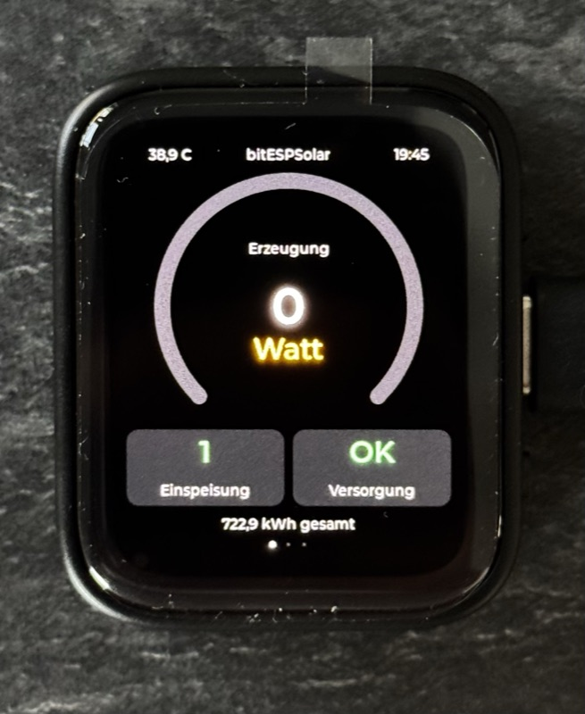
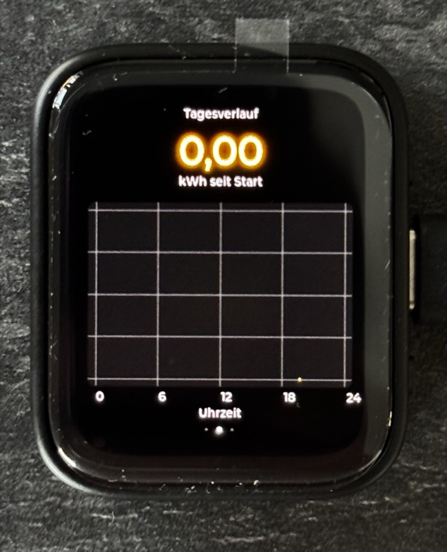
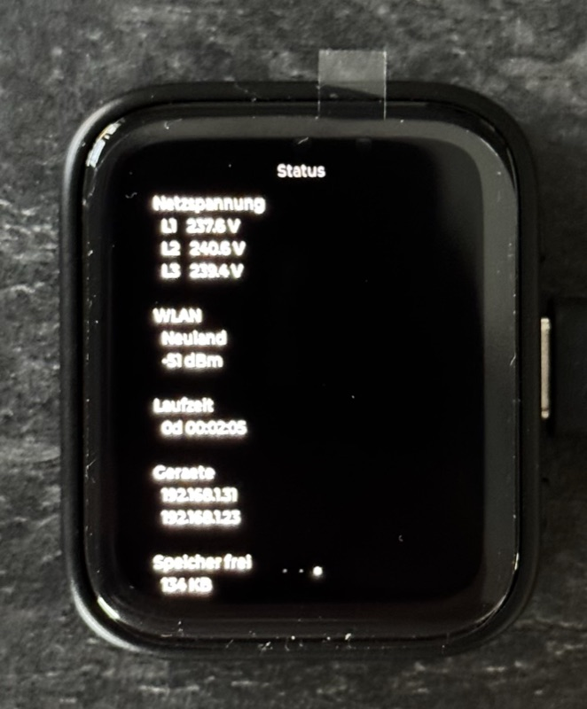

# bitSolarMonitor

Ein kleiner PV-Monitor für den Waveshare ESP32-S3-Touch-AMOLED-1.8. Er liest
Shelly-Geräte direkt im lokalen Netz aus und zeigt, was die Photovoltaik-Anlage
gerade produziert. Ohne Cloud, ohne Konto, ohne Zwischenserver.

Wie das Projekt entstanden ist, steht ausführlich im Blogbeitrag:
**[bitSolarMonitor auf bitlager.de](https://blog.bitlager.de/de/posts/tech/balkonkraftwerk-esp32-s3-amoled-pv-monitor/)**. Weitere ESP32-Projekte
gibt es auf der [Projektseite](https://blog.bitlager.de/esp32/).

## Was es anzeigt

Drei Seiten, gewischt wird mit dem Finger. Drei Punkte am unteren Rand zeigen,
wo man gerade ist.

Die Hauptseite wechselt dabei ihre Rolle: Solange die Sonne liefert, gehört
der große Ring der Erzeugung. Fällt sie auf null, wäre ein Ring auf null
verschenkte Fläche. Dann übernimmt der Speicher, mit seinem Ladezustand als
Füllstand und seiner Lade- oder Entladeleistung in der Mitte.

| Erzeugung | Tagesverlauf | Status |
|:---:|:---:|:---:|
|  |  |  |
| Aktuelle Leistung im Ring, dazu Netz und Versorgungslage. Oben Temperatur und Uhrzeit. | Ertrag und Verlauf über 24 Stunden im Fünf-Minuten-Raster. | Netzspannung je Phase, WLAN, Laufzeit, gefundene Geräte. |

Die Aufnahmen entstanden am Abend, deshalb 0 Watt und eine noch leere Kurve.

Der obere der beiden Knöpfe schaltet die Helligkeit in drei Stufen durch
(25, 50, 100 Prozent). Nach 30 Sekunden ohne Berührung dimmt das Display auf
ein Viertel herunter, ganz aus geht es nie.

## Ausbaustufen

Das Projekt funktioniert auch mit nur einem Gerät. Was fehlt, wird nicht
angezeigt, statt eine Fehlermeldung zu produzieren.

1. **Shelly Plug** am Wechselrichter. Zeigt die Erzeugung.
2. **Plus Shelly Pro 3EM** am Netzübergabepunkt. Zeigt Netzbezug und Einspeisung.
3. **Plus Home Assistant.** Zeigt den Ladezustand des Speichers und den
   tatsächlich abrufbaren Vorrat in kWh. Grün mit Pfeil nach oben heißt laden,
   rot mit Pfeil nach unten entladen.

## Voraussetzungen

* Waveshare ESP32-S3-Touch-AMOLED-1.8 (16 MB Flash, 8 MB PSRAM)
* Ein Shelly mit Leistungsmessung, etwa Outdoor Plug S oder Plug S
* **USB-C auf USB-C Datenkabel.** Ein reines Ladekabel reicht nicht.
* WLAN im 2,4-GHz-Band
* ESP-IDF v5.5 oder neuer

## Installation

ESP-IDF einmalig einrichten:

```bash
git clone -b v5.5.5 --depth 1 --recursive https://github.com/espressif/esp-idf.git ~/esp/esp-idf
cd ~/esp/esp-idf && ./install.sh esp32s3
```

Projekt holen, konfigurieren, flashen:

```bash
git clone https://github.com/thisdev/bitSolarMonitor.git
cd bitSolarMonitor
cp local.defaults.example local.defaults    # WLAN eintragen
source activate.sh
idf.py flash monitor
```

`activate.sh` sucht ESP-IDF an den üblichen Stellen, stellt bei Bedarf eine
passende Python-Version voran und ermittelt den Port des angeschlossenen
Boards.

## Konfiguration

Alles Persönliche steht in `local.defaults`, die per `.gitignore` außen vor
bleibt. Als Vorlage dient `local.defaults.example`.

```ini
CONFIG_PVMON_WIFI_SSID="MeinWLAN"
CONFIG_PVMON_WIFI_PASS="MeinPasswort"

# Maximale Leistung am Messpunkt. Skaliert Ring und Kurve.
CONFIG_PVMON_INVERTER_LIMIT_W=800

# Stufe 2
CONFIG_PVMON_EM_ENABLE=y

# Sitzt ein Batteriespeicher zwischen dem gemessenen Wechselrichter und dem
# Netzübergabepunkt? Dann ist der Hausverbrauch nicht ableitbar.
CONFIG_PVMON_STORAGE_BETWEEN=y

# Stufe 3
CONFIG_PVMON_HA_ENABLE=y
CONFIG_PVMON_HA_HOST="192.168.1.50:8123"
CONFIG_PVMON_HA_TOKEN="eyJhbGciOi..."
CONFIG_PVMON_HA_ENTITY_SOC="sensor.speicher_battery_soc"
CONFIG_PVMON_HA_ENTITY_POWER="sensor.speicher_battery_power"
CONFIG_PVMON_HA_POWER_INVERT=y     # falls negativ Laden bedeutet
CONFIG_PVMON_HA_ENTITY_CAPACITY="sensor.speicher_rated_capacity"
CONFIG_PVMON_HA_CAPACITY_WH=3590   # nur Rückfall, falls die Entität fehlt
```

Den Token legt man in Home Assistant unter Profil, Reiter Sicherheit, ganz
unten an. Zwei Punkte sind erfahrungsgemäß fehlerträchtig:

* **Das Vorzeichen der Speicherleistung.** Manche Sensoren melden Laden
  positiv, andere negativ. Ein Blick in die Verlaufsgrafik von Home Assistant
  klärt das: Steigt der Ladezustand, während die Leistung negativ ist, gehört
  `CONFIG_PVMON_HA_POWER_INVERT=y` gesetzt.
* **Die Kapazität.** Sie steckt oft nicht im Produktnamen. Ein "SF2000" hat
  2000 W Ausgangsleistung, aber 3,59 kWh Kapazität. Meist meldet das Gerät
  sie selbst als "Rated capacity". Trägt man diese Entität ein, muss die Zahl
  nirgends von Hand gepflegt werden, und ein späterer Speicherausbau wird von
  allein berücksichtigt.

Die IP-Adressen der Shellys müssen nicht eingetragen werden. Der Monitor sucht
sie per mDNS und ordnet sie danach zu, **wie sie antworten**, nicht nach
Modellnummer:

* antwortet auf `EM.GetStatus` mit `total_act_power` → Energiezähler
* antwortet auf `Switch.GetStatus` mit `apower` → Plug

Damit funktioniert die Erkennung auch mit Modellen, die es beim Schreiben
dieses Codes noch nicht gab. Eine fest eingetragene Adresse hat Vorrang.

## Aufbau

```
main/
  bitsolarmonitor.c   Ablauf: Anzeige starten, WLAN, Geräte suchen, Abrufschleife
  energy.c/h      Datenmodell. Jeder Messwert weiß selbst, ob er gilt
  shelly.c/h      HTTP-Abruf, JSON, Gerätesuche per mDNS
  net.c/h         WLAN-Verbindung
  clock.c/h       Uhrzeit per NTP
  history.c/h     Tagesverlauf im Fünf-Minuten-Raster, Ertragsrechnung
  ha.c/h          Home Assistant über die REST-Schnittstelle
  ui.c/h          Oberfläche mit LVGL, drei Seiten
  backlight.c/h   Helligkeitsstufen und Ruheabsenkung
```

Der Kern ist ein Messwert, der seine eigene Gültigkeit kennt:

```c
typedef struct {
    bool  valid;
    float value;
} measurement_t;
```

Die Oberfläche zeigt nur, was gilt. Deshalb braucht keine Ausbaustufe eine
Sonderbehandlung in der Anzeige.

## Bekannte Einschränkungen

* **Hausverbrauch bei Speicheranlagen.** Sitzt ein Speicher zwischen Messpunkt
  und Netzzähler, puffert er dazwischen. Ladeleistung und Verbrauch sind dann
  nicht zu trennen, der Hausverbrauch ist rechnerisch nicht zugänglich. Statt
  einer falschen Zahl zeigt das Gerät, ob die Anlage das Haus gerade trägt.
* **Ertrag heißt "seit Start"**, bis das Gerät einen Mitternachtswechsel
  miterlebt hat. Der Shelly Plug führt keine Tageshistorie.
* **Der Tagesverlauf lebt im Arbeitsspeicher.** Ein Neustart löscht die Kurve.
* **Ein nicht nutzbarer Sockel** lässt sich über `CONFIG_PVMON_HA_RESERVE_PCT`
  abziehen, falls der Speicher unterhalb eines Ladezustands nichts mehr abgibt
  und der gemeldete Wert diesen Sockel mitzählt. Im Zweifel bei 0 lassen. Ein
  zu hoher Wert zeigt dauerhaft zu wenig Vorrat an.
* **Seitenwechsel direkt nach dem Start** reagiert gelegentlich noch nicht.
* **Zugangsdaten sind einkompiliert.** Ein fertiges Abbild darf deshalb nicht
  weitergegeben werden, es enthält WLAN-Name und Passwort im Klartext.

## Lizenz

MIT, siehe [LICENSE](LICENSE).
